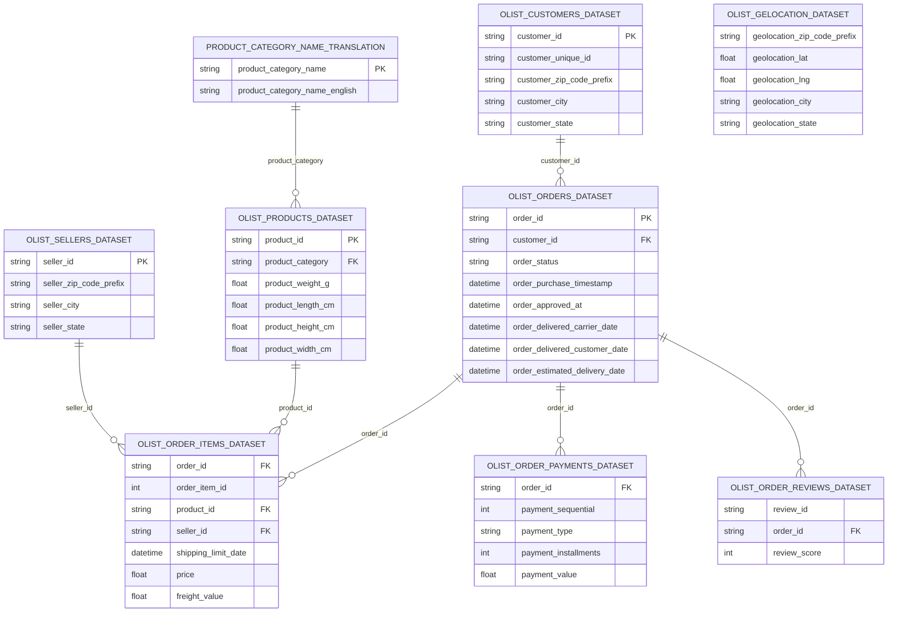

# Olist E-Commerce Data Analysis & Interactive Dashboard

> **An end-to-end e-commerce data analysis project built in Excel using Power Query, Power Pivot, DAX, Pivot Tables, and interactive dashboards to evaluate sales, customers, products, payments, reviews, sellers, and delivery performance.**

---


## 📋 Table of Contents

1. [Project Overview](#1-project-overview)
2. [Objectives](#2-objectives)
3. [Project Scope & Tools](#3-project-scope--tools)
4. [Dataset](#4-dataset)
5. [Data Workflow](#5-data-workflow)
6. [Data Cleaning & Transformation](#6-data-cleaning--transformation)
7. [Data Model & Relationships](#7-data-model--relationships)
8. [Power Pivot & DAX](#8-power-pivot--dax)
9. [Pivot Tables & Analysis](#9-pivot-tables--analysis)
10. [Dashboard](#10-dashboard)
11. [Key Insights](#11-key-insights)
12. [Business Problems Identified](#12-business-problems-identified)
13. [Recommendations](#13-recommendations)
14. [Assumptions & Limitations](#14-assumptions--limitations)
15. [Future Enhancements](#15-future-enhancements)
16. [Deliverables](#16-deliverables)
17. [Author](#17-author)

---

# 1. Project Overview

## Context

Olist is a Brazilian e-commerce marketplace that connects sellers with customers through an online platform.

The project uses the public **Olist Brazilian E-Commerce Dataset**, which contains multiple interconnected datasets covering orders, customers, products, sellers, payments, reviews, delivery, and geographical information.

The objective was to transform the raw relational datasets into a structured analytical model and build an interactive Excel dashboard capable of answering key business questions.

## Problem Statement

The raw data is distributed across multiple tables, making it difficult to obtain a unified view of:

* Sales performance
* Order volume
* Customer activity
* Product performance
* Seller performance
* Payment behavior
* Customer satisfaction
* Delivery performance
* Geographic performance

The project therefore focuses on answering:

> **How is the Olist marketplace performing across sales, customers, products, payments, reviews, sellers, and delivery, and what business issues can be identified from the data?**

## Approach

The project followed an end-to-end analytical workflow:

**Raw Data → Power Query → Data Cleaning & Transformation → Power Pivot Data Model → DAX Measures → Pivot Tables → Interactive Dashboard → Business Insights & Recommendations**

## Outcome

The final result is an interactive Excel Business Intelligence solution containing:

* Cleaned and transformed datasets
* A relational Power Pivot Data Model
* DAX measures and calculated metrics
* Multiple Pivot Tables
* Executive-level KPIs
* Interactive dashboards
* Business insights and recommendations

---

# 2. Objectives

### Primary Objective

Build a complete analytical solution that converts Olist's raw multi-table e-commerce data into actionable business insights using Excel.

### Secondary Objectives

* Analyze overall sales and revenue performance.
* Evaluate order and delivery performance.
* Understand customer and geographic distribution.
* Identify high-performing product categories.
* Analyze seller performance.
* Understand payment methods and transaction behavior.
* Evaluate customer reviews and satisfaction.
* Identify operational and business issues.
* Build an interactive dashboard for decision-making.

---

# 3. Project Scope & Tools

## Scope

| Dimension           | Details                                                                             |
| ------------------- | ----------------------------------------------------------------------------------- |
| **Business Domain** | E-commerce / Marketplace                                                            |
| **Geography**       | Brazil                                                                              |
| **Data Source**     | Olist Brazilian E-Commerce Dataset                                                  |
| **Analysis Period** | 2016–2018                                                                           |
| **Granularity**     | Order, order-item, customer, seller, product, payment, review and geographic levels |
| **Main Focus**      | Sales, Orders, Customers, Products, Sellers, Payments, Reviews and Delivery         |

### Out of Scope

The project does not include:

* Predictive machine learning
* Customer lifetime value prediction
* Demand forecasting
* Marketing campaign attribution
* Real-time analytics
* Profitability analysis based on actual Olist operating costs

---

# 4. Dataset

The project is based on the following nine original datasets:

| Dataset                             | Purpose                                            |
| ----------------------------------- | -------------------------------------------------- |
| `olist_customers_dataset`           | Customer information and location                  |
| `olist_geolocation_dataset`         | Brazilian geographical information                 |
| `olist_order_items_dataset`         | Products included in each order                    |
| `olist_order_payments_dataset`      | Payment transactions and payment methods           |
| `olist_order_reviews_dataset`       | Customer reviews and review scores                 |
| `olist_orders_dataset`              | Order lifecycle and timestamps                     |
| `olist_products_dataset`            | Product attributes and categories                  |
| `olist_sellers_dataset`             | Seller information and location                    |
| `product_category_name_translation` | Portuguese-to-English product category translation |

The datasets were loaded and transformed through **Power Query** before being incorporated into the Power Pivot Data Model.

---

# 5. Data Workflow

```text
                 Olist Raw Datasets
                         │
                         ▼
                  Power Query
                         │
                         ▼
              Data Cleaning & ETL
                         │
                         ▼
             Power Pivot Data Model
                         │
                         ▼
                  Relationships
                         │
                         ▼
                   DAX Measures
                         │
                         ▼
                   Pivot Tables
                         │
                         ▼
             Interactive Dashboards
                         │
                         ▼
              Business Insights
                         │
                         ▼
                Recommendations
```

## 5.1 Data Source

The project started with nine separate CSV datasets from the Olist Brazilian E-Commerce Dataset.

## 5.2 Ingestion

The datasets were imported into Excel using **Power Query**.

Each source dataset was maintained as a separate query/table so that the original relational structure could be preserved.

## 5.3 Data Cleaning & Transformation

Power Query was used as the main ETL layer.

The workflow included tasks such as:

* Reviewing column structures and data types.
* Standardizing data types.
* Handling missing/null values where appropriate.
* Preparing date/time columns for analysis.
* Standardizing categorical values.
* Preparing product categories for analysis.
* Connecting the Portuguese product category names with their English translations.
* Preparing tables for relationships in the Power Pivot Data Model.
* Removing unnecessary fields where appropriate.
* Creating/transforming fields required for analytical calculations.

The goal was to prepare consistent tables while preserving the original business meaning of the Olist data.

---

# 6. Data Cleaning & Transformation

The project separates **data preparation** from **analytical calculations**.

### Power Query — ETL Layer

Power Query was responsible for:

* Importing the source datasets.
* Cleaning and transforming data.
* Preparing columns and data types.
* Structuring the datasets for modeling.
* Preparing the product category translation.
* Creating a refreshable data preparation workflow.

### Power Pivot — Modeling Layer

Power Pivot was then used to:

* Load the prepared tables into the Data Model.
* Establish relationships between the tables.
* Create a unified analytical structure.
* Define DAX measures.

### Important Technical Distinction

> **Power Query uses M language for data transformation, while Power Pivot/Data Model uses DAX for analytical calculations and Measures.**

This separation makes the project easier to maintain and refresh.

---

# 7. Data Model & Relationships

The workbook contains a Power Pivot Data Model with the following nine tables:

* `olist_customers_dataset`
* `olist_geolocation_dataset`
* `olist_order_items_dataset`
* `olist_order_payments_dataset`
* `olist_order_reviews_dataset`
* `olist_orders_dataset`
* `olist_products_dataset`
* `olist_sellers_dataset`
* `product_category_name_translation`

## Relationships Found in the Workbook

| From Table                     | Column             | To Table                            | Column                  | Relationship |
| ------------------------------ | ------------------ | ----------------------------------- | ----------------------- | ------------ |
| `olist_order_items_dataset`    | `order_id`         | `olist_orders_dataset`              | `order_id`              | Many-to-One  |
| `olist_order_items_dataset`    | `product_id`       | `olist_products_dataset`            | `product_id`            | Many-to-One  |
| `olist_order_items_dataset`    | `seller_id`        | `olist_sellers_dataset`             | `seller_id`             | Many-to-One  |
| `olist_order_payments_dataset` | `order_id`         | `olist_orders_dataset`              | `order_id`              | Many-to-One  |
| `olist_order_reviews_dataset`  | `order_id`         | `olist_orders_dataset`              | `order_id`              | Many-to-One  |
| `olist_orders_dataset`         | `customer_id`      | `olist_customers_dataset`           | `customer_id`           | Many-to-One  |
| `olist_products_dataset`       | `product_category` | `product_category_name_translation` | `product_category_name` | Many-to-One  |

### Main Analytical Flow

```text
Customers
    │
    │ customer_id
    ▼
Orders
 ├───────────────┬──────────────────┬─────────────────┐
 │ order_id      │ order_id         │ order_id        │
 ▼               ▼                  ▼
Order Items    Payments           Reviews
 │
 ├── product_id ──► Products ──► Category Translation
 │
 └── seller_id ───► Sellers
```

---

# 7.1 ERD

The following Mermaid diagram represents the actual relationships implemented in the Power Pivot Data Model:



> **Note:** `olist_geolocation_dataset` exists in the project/model source structure, but the workbook's explicit Power Pivot relationships do not show a direct relationship from the geolocation table to the other tables. Therefore, it should not be represented as an active relational path in the analytical model.

---

# 8. Power Pivot & DAX

DAX was used to create analytical Measures in the Power Pivot Data Model.

The workbook contains measures covering:

* Orders
* Sales
* Revenue
* Freight
* Customers
* Products
* Sellers
* Payments
* Reviews
* Delivery performance

## Main DAX Measures

### Total Orders

```DAX
Total Orders =
DISTINCTCOUNT(olist_orders_dataset[order_id])
```

Counts the distinct number of orders.

---

### Delivered Orders

```DAX
Delivered Orders =
CALCULATE(
    [Total Orders],
    olist_orders_dataset[order_status] = "delivered"
)
```

Counts orders whose status is `delivered`.

---

### Delivery Rate

```DAX
Delivery Rate =
DIVIDE(
    [Delivered Orders],
    [Total Orders]
)
```

Measures the percentage of orders that were successfully delivered.

---

### Orders per Customer

```DAX
Orders per Customer =
DIVIDE(
    [Total Orders],
    [Total Customers]
)
```

Measures the average number of orders per customer.

---

### Total Sales

```DAX
Total Sales =
SUM(olist_order_items_dataset[price])
```

Calculates the total value of products sold before freight.

---

### Total Freight

```DAX
Total Freight =
SUM(olist_order_items_dataset[freight_value])
```

Calculates total freight charges associated with order items.

---

### Total Revenue

```DAX
Total Revenue =
[Total Sales] + [Total Freight]
```

Combines product sales and freight value into the project's revenue metric.

---

### Total Items Sold

```DAX
Total Items Sold =
COUNTROWS(olist_order_items_dataset)
```

Counts the number of order-item records.

---

### Average Item Price

```DAX
Average Item Price =
AVERAGE(olist_order_items_dataset[price])
```

Calculates the average selling price per item.

---

### Total Payments

```DAX
Total Payments =
SUM(olist_order_payments_dataset[payment_value])
```

Calculates the total recorded payment value.

---

### Average Payment

```DAX
Average Payment =
AVERAGE(olist_order_payments_dataset[payment_value])
```

Calculates the average value of a payment transaction.

---

### Average Installments

```DAX
Average Installments =
AVERAGE(olist_order_payments_dataset[payment_installments])
```

Measures the average number of installments used in payment transactions.

---

### Total Reviews

```DAX
Total Reviews =
DISTINCTCOUNT(olist_order_reviews_dataset[review_id])
```

Counts distinct customer reviews.

---

### Average Review Score

```DAX
Average Review Score =
AVERAGE(olist_order_reviews_dataset[review_score])
```

Calculates the average customer review score.

---

### Positive Reviews

```DAX
Positive Reviews =
CALCULATE(
    [Total Reviews],
    olist_order_reviews_dataset[review_score] >= 4
)
```

Counts reviews with a score of 4 or 5.

---

### Negative Reviews

```DAX
Negative Reviews =
CALCULATE(
    [Total Reviews],
    olist_order_reviews_dataset[review_score] <= 2
)
```

Counts reviews with a score of 1 or 2.

---

### Positive Review Rate

```DAX
Positive Review Rate =
DIVIDE(
    [Positive Reviews],
    [Total Reviews]
)
```

Measures the proportion of reviews classified as positive.

---

### Sellers

```DAX
Sellers =
DISTINCTCOUNT(olist_order_items_dataset[seller_id])
```

Counts distinct sellers represented in order-item transactions.

---

## Delivery Analysis Measures

The model also contains calculations for:

* On-Time Orders
* Late Orders
* On-Time Rate
* Average Delivery Days
* Average Days Late

These measures allow delivery performance to be analyzed by year, geography and other dimensions.

---

# 9. Pivot Tables & Analysis

After building the Data Model and DAX Measures, Pivot Tables were created to analyze different business dimensions.

The workbook contains analytical sections for:

### Orders

* Total Orders
* Order Status
* Delivered Orders
* Canceled Orders
* Delivery Rate
* Orders by Year
* Orders by Quarter
* Orders by Month
* Orders by State

### Customers

* Total Customers
* Customers by State
* Customers by City
* Orders per Customer
* Customers with Orders
* Geographic distribution

### Sales

* Total Sales
* Total Revenue
* Total Freight
* Total Payments
* Sales by Year
* Sales by Month
* Sales by Quarter
* Sales by State

### Products

* Items Sold
* Average Item Price
* Product Categories
* Category-level sales/performance

### Sellers

* Seller Sales
* Sellers by State
* Seller performance

### Payments

* Payment Amount
* Payment Transactions
* Payment Type
* Installments
* Average Payment

### Reviews

* Total Reviews
* Review Score Distribution
* Average Review Score
* Positive Reviews
* Negative Reviews
* Positive Review Rate

### Delivery

* Delivery Rate
* On-Time Orders
* Late Orders
* Average Delivery Days
* Average Days Late
* Delivery performance by year and state

---

# 10. Dashboard

The workbook contains multiple dashboard views:

* `DB_Home`
* `DB_Orders`
* `DB_Customers`
* `DB_Sales`
* `DB_Products`
* `DB_Sellers`
* `DB_Payments`
* `DB_Reviews`
* `DB_Delivery`
* `DB_Geography`

The dashboards are powered by Pivot Tables and the Power Pivot Data Model.

## Executive Dashboard KPIs

The executive analysis includes:

| KPI                   |  Result |
| --------------------- | ------: |
| Total Revenue         |  15.84M |
| Total Sales           |  13.59M |
| Total Freight         |   2.25M |
| Total Customers       |  96,096 |
| Total Orders          |  99,441 |
| Average Order Value   |  136.66 |
| Total Items Sold      | 112,650 |
| Total Sellers         |   3,095 |
| Delivered Orders      |  96,478 |
| Delivery Rate         |  97.02% |
| Average Item Price    |  120.64 |
| Total Payments        |  16.01M |
| Total Reviews         |  98,410 |
| Positive Reviews      |  75,917 |
| Negative Reviews      |  14,396 |
| Positive Review Rate  |  77.14% |
| Average Review Score  |    4.09 |
| On-Time Orders        |  88,649 |
| On-Time Rate          |  91.89% |
| Average Delivery Days |   12.52 |
| Average Days Late     |    9.72 |
| Late Orders           |   7,827 |

---

# 11. Key Insights

## 1. Strong Overall Order Delivery Completion

The analysis shows:

* **99,441 total orders**
* **96,478 delivered orders**
* **97.02% delivery rate**

This indicates that the large majority of recorded orders reached the delivered status.

However, delivery completion and delivery punctuality are not the same metric. The model shows an **On-Time Rate of approximately 91.89%**, highlighting that some delivered orders still experienced delays.

---

## 2. Sales Growth Was Concentrated in 2017–2018

Sales increased substantially after the early period of the dataset.

Recorded sales were approximately:

* **2016:** 49.8K
* **2017:** 6.16M
* **2018:** 7.38M

The strongest sales activity therefore occurred during 2017 and 2018.

This suggests a significant expansion in marketplace transaction activity during the observed period.

---

## 3. São Paulo Is the Dominant Geographic Market

The geographic analysis shows São Paulo as a major contributor to marketplace activity.

The state recorded approximately:

* **41,746 orders**
* **5.998M in sales**

This makes São Paulo a critical market when evaluating overall Olist performance.

---

## 4. Payment Activity Exceeds Product Sales

The model reports approximately:

* **13.59M Total Sales**
* **16.01M Total Payments**

These metrics should not be interpreted as directly equivalent measures.

Payment records can contain multiple transactions associated with an order, while product sales are calculated from order-item prices.

This highlights the importance of understanding table grain before comparing financial metrics.

---

## 5. Customer Satisfaction Is Generally Positive but Not Uniform

The analysis shows:

* **98,410 reviews**
* **4.09 average review score**
* **77.14% positive review rate**
* **14,396 negative reviews**

Although the overall average score is relatively high, the presence of a substantial number of low-score reviews indicates that customer experience still contains areas requiring investigation.

---

## 6. Delivery Speed Improved Over Time

Average delivery days were approximately:

| Year | Average Delivery Days |
| ---- | --------------------: |
| 2016 |                 19.67 |
| 2017 |                 13.00 |
| 2018 |                 12.08 |

The data shows a clear reduction in average delivery time across the observed years.

This indicates an improvement in delivery speed over the period covered by the dataset.

---

# 12. Business Problems Identified

Based on the analysis, the major areas requiring business attention are:

### 1. Delivery Delays

Although the overall delivery rate is high, the model identifies:

* 7,827 late orders
* 91.89% on-time rate

Delivery punctuality therefore remains an operational performance area.

### 2. Negative Customer Reviews

The dataset contains:

* 14,396 negative reviews

These reviews represent an opportunity to investigate the relationship between customer satisfaction and:

* Delivery delays
* Product categories
* Sellers
* Payment/order experience

### 3. Geographic Concentration

A significant proportion of activity is concentrated in major Brazilian states, particularly São Paulo.

This creates an opportunity to analyze whether operational performance differs between high-volume and lower-volume regions.

### 4. Payment vs. Sales Interpretation

The difference between payment value and product sales highlights the complexity of the payment data.

Financial KPIs should therefore always be interpreted according to the underlying table grain.

---

# 13. Recommendations

## Delivery Performance

Analyze late orders by:

* State
* Seller
* Product category
* Order period
* Estimated vs. actual delivery date

The objective would be to identify where delivery delays are concentrated.

## Customer Experience

Investigate low review scores against:

* Delivery delays
* Product categories
* Sellers
* Order status

This could help distinguish operational problems from product-specific issues.

## Geographic Performance

Monitor performance by state using:

* Sales
* Orders
* Customers
* Delivery Rate
* On-Time Rate

High-volume states should be monitored separately from low-volume markets.

## Seller Performance

Create a seller performance framework combining:

* Sales
* Order volume
* Delivery performance
* Customer reviews

This would help identify sellers that contribute strongly to marketplace activity while also highlighting sellers associated with operational or customer-experience issues.

## Payment Analysis

Separate:

* Order-level financial metrics
* Payment-transaction metrics

This avoids interpreting multiple payment records as independent sales.

---

# 14. Assumptions & Limitations

### Assumptions

* The Olist dataset is treated as representative of the marketplace activity captured during the dataset period.
* `Total Sales` is based on the `price` field from order items.
* `Total Revenue` in this project is defined as Total Sales + Total Freight.
* Positive reviews are defined as scores ≥ 4.
* Negative reviews are defined as scores ≤ 2.
* Delivery performance calculations depend on the available order timestamps.

### Limitations

* The dataset represents historical activity and does not provide real-time marketplace performance.
* The dataset does not contain complete operating-cost information, so true business profit cannot be calculated.
* Marketing spend and campaign performance are not available.
* Customer demographic information is limited.
* The analysis identifies associations and patterns but does not establish causal relationships.
* The geolocation table exists in the dataset but is not explicitly connected through an active Power Pivot relationship in the current workbook.
* Payment records operate at a different grain from order-item sales, so payment totals should not be directly interpreted as sales revenue.

---

# 15. Future Enhancements

Possible extensions of the project include:

* [ ] Build a dedicated Date/Calendar table.
* [ ] Add a more comprehensive geographic model connecting customer/seller locations to geolocation data.
* [ ] Analyze seller-level delivery and review performance.
* [ ] Investigate the relationship between delivery delays and review scores.
* [ ] Add product profitability if cost data becomes available.
* [ ] Build automated refresh and reporting workflows.
* [ ] Recreate the model in Power BI for more advanced visualization and deployment.
* [ ] Add predictive analysis for sales or delivery performance.

---

# 16. Deliverables

| Deliverable                 | Description                                      |
| --------------------------- | ------------------------------------------------ |
| `Olist Dashboard.xlsx`      | Complete Excel analytical solution               |
| Power Query transformations | Data ingestion, cleaning and preparation         |
| Power Pivot Data Model      | Relational model connecting the Olist datasets   |
| DAX Measures                | Analytical KPIs and calculations                 |
| Pivot Tables                | Detailed business analysis                       |
| Excel Dashboards            | Interactive visualization and reporting          |
| README                      | Project documentation and analytical explanation |

---

# 17. Author

**Hazem Waleed**

**Data Analyst **

* 🔗 LinkedIn: [https://www.linkedin.com/in/7azem-waleed-ai/?isSelfProfile=true]
* 💼 GitHub: [HazemWaleed517]

---

*Project completed using Excel, Power Query, Power Pivot, DAX, Pivot Tables and interactive dashboards.*
